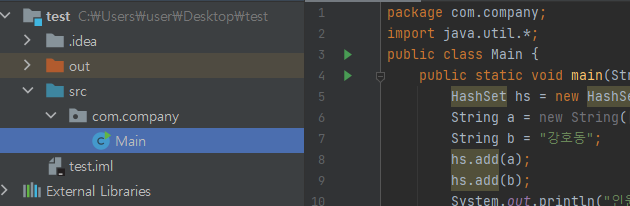

# Package

자바의 패키지도 이것과 완전히 동일한 개념
패키지는 비슷한 성격의 자바 클래스들을 모아 넣는 자바의 디렉토리



`Main`이라는 파일이 현재 `com.company`라는 폴더 안에 있으므로 `package com.company`라고 함
참고로 파일이름이 `Main`이므로 `public class Main`이라고 적었음
(파일이름이 다르면 다르게 적어야 함)


# SubPackage

```java
package jump2java.house.person;
```

위 코드처럼 점(.)을 이용해 하위 패키지를 계속 만들어 나갈 수 있음
(`jump2java.house.person`는 `jump2java.house`의 서브 패키지)


# Import

다른 클래스에 있는 클래스를 사용하기 위해서는 `import`를 해야 함

```java
import jump2java.house.HouseKim; // 다른 클래스에서 HouseKim이라는 클래스를 사용하기 위해
```

```java
import jump2java.house.*;
```

`*`을 사용하면 `house`안에 있는 모든 클래스를 `import`하게 됨