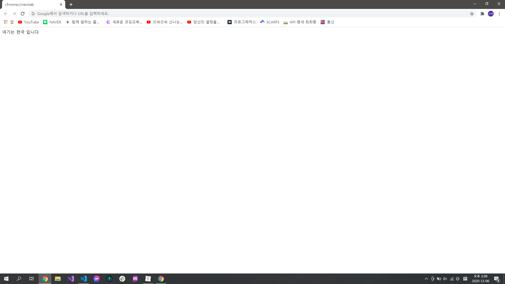
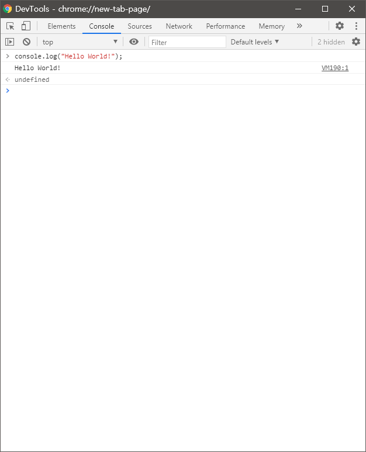

# `prompt()`

```javascript
var a = prompt("숫자를 입력하세요");
// a에 프롬프트 창에서 입력한 값이 저장됨
```


# `alert()`

```javascript
alert("안녕하세요");
// "안녕하세요"라는 글이 알림으로 뜸
```


# `document.write()`

```javascript
document.write("여기는 천국 입니다");
// "여기는 천국 입니다"라는 글이 웹 브라우저에 출력이 됨
```



# `console.log()`

```javascript
console.log("Hello World!");
// "Hello World!"라는 글자가 콘솔 창에 출력됨
```

